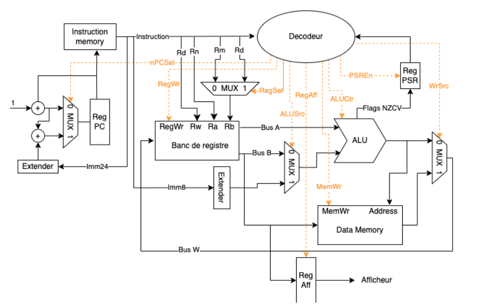

# 32-bit Single-Cycle Processor & SoC

### ARM-like 32-bit CPU · VHDL · FPGA · UART · Interrupt Controller

Design, simulation, and FPGA implementation of a **32-bit single-cycle processor inspired by the ARM architecture**, fully developed in **VHDL** and targeting an **Intel Cyclone V FPGA**.

The system integrates:

* 🧠 A **32-bit single-cycle processor**
* ⚙️ A **datapath** with ALU, register file, and data memory
* 🎛️ An **instruction control unit** with ARM-like instruction decoding
* 🚨 A **Vectored Interrupt Controller (VIC)** with prioritized interrupt sources
* 📡 A **UART TX/RX** serial interface
* 🔢 A **multiplexed 7-segment display**
* 🧪 **Self-checking VHDL testbenches**
* 🔧 FPGA synthesis and implementation using **Intel Quartus Prime**

> **Project focus:** RTL design, processor architecture, digital design, hardware verification, UART communication, and FPGA implementation.

---

## 📐 System Architecture



```text
                         +---------------------------+
                         |      IRQ0 / IRQ1         |
                         |   Interrupt Vectors      |
                         +-------------+-------------+
                                       |
                                       v
+---------------------+      +-----------------+      +---------------------+
|                     |      |                 |      |                     |
|  Instruction Unit   +----->+  Control Unit   +----->+      Datapath       |
|                     |      |                 |      |                     |
|  PC                 |      |  Instruction    |      |  Register File      |
|  Instruction ROM    |      |  Decoder        |      |  ALU                |
|  Sign Extension     |      |  PSR            |      |  Data Memory        |
|                     |      |                 |      |                     |
+----------^----------+      +-----------------+      +----------+----------+
           |                                                    |
           |                 Data / Control Bus                 |
           +----------------------------------------------------+
                                |
             +------------------+------------------+
             |                  |                  |
             v                  v                  v
      +-------------+    +-------------+    +-------------+
      | UART TX/RX  |    |     VIC     |    |  7-Segment  |
      | Baud Gen.   |    | Interrupt   |    |  Display &  |
      |             |    | Controller  |    | Registers   |
      +-------------+    +-------------+    +-------------+
```

---

# 🚀 Technical Highlights

## 1. 32-bit Single-Cycle Processor

### Datapath

Located in `rtl/datapath/`.

* **16 × 32-bit general-purpose registers**

  * asynchronous combinational read
  * synchronous write on rising clock edge

* **32-bit ALU** supporting:

  * `ADD`
  * `SUB`
  * `AND`
  * `ORR`
  * `EOR`
  * `NOT`
  * `CMP`

* **Processor Status Register (PSR)** with:

  * `N` — Negative
  * `Z` — Zero
  * `C` — Carry
  * `V` — Overflow

* **32-bit data RAM**

  * `LDR`
  * `STR`

### Instruction Unit

Located in `rtl/instruction_unit/`.

The instruction unit provides:

* Program Counter (`PC`) management
* Sequential execution using `PC + 1`
* Relative branch target computation
* 24-bit → 32-bit sign extension
* Automatic return-address storage in `R14 / LR` during interrupt servicing

### Control Unit

Located in `rtl/control_unit/`.

The control unit performs combinational decoding of ARM-like instruction formats:

* Data Processing
* Memory Transfer
* Branching

It generates the following control signals:

```text
nPC_sel
RegWr
ALUSrc
ALUCtrl
PSREn
MemWr
WrSrc
RegSel
RegAff
```

---

# 🚨 2. Vectored Interrupt Controller (VIC)

The processor includes a **Vectored Interrupt Controller** supporting two hardware interrupt sources with different priorities.

| Interrupt | Priority | Source               | Vector       |
| --------- | -------- | -------------------- | ------------ |
| `IRQ0`    | High     | External push-button | `0x00000009` |
| `IRQ1`    | Low      | UART / serial event  | `0x00000015` |

### Interrupt Handling

The interrupt mechanism follows this sequence:

```text
Interrupt detected
       │
       ▼
Save return address in LR
       │
       ▼
Select interrupt vector
       │
       ▼
Execute interrupt service routine
       │
       ▼
       BX
       │
       ▼
Return to interrupted program
```

The return mechanism uses:

```text
PC <= LR + 1
```

---

# 📡 3. UART Interface

The system integrates both **UART transmitter and receiver**.

## UART Transmitter

The `uart_tx` module generates standard **8N1 serial frames**:

```text
+-------+----------------+--------+
| Start |  8 data bits   | Stop   |
|   0   |   LSB first    |   1    |
+-------+----------------+--------+
```

Transmission is driven by a baud-rate tick generator.

### Interrupt-driven transmission

When `IRQ1` is asserted, the processor automatically transmits the ASCII character:

```text
'1'
```

on the UART TX line.

## UART Receiver

The `uart_rx` module:

* samples the incoming serial bitstream;
* reconstructs the received data;
* stores the received byte in the corresponding data register.

---

# 🔢 4. 7-Segment Display

The FPGA design includes a **multiplexed 7-segment display interface**.

The peripheral subsystem provides:

* 7-segment decoding
* display multiplexing
* associated control registers

This allows processor and peripheral information to be displayed directly on the FPGA board.

---

# 🧪 Verification & Simulation

The design is verified using dedicated **self-checking VHDL testbenches**.

Automated verification relies on:

```vhdl
assert / report
```

The testbenches cover the main functional blocks:

* ALU
* Datapath
* Processor core
* VIC
* UART transmitter

## ModelSim / QuestaSim

Simulation scripts are located in:

```text
sim/
```

Example:

```tcl
cd sim

vsim -do simu_alu.do
vsim -do simu_processor_core_vic.do
vsim -do simu_uart_tx.do
```

### Simulation Results


---

# 🖥️ FPGA Implementation

The design targets an **Intel Cyclone V FPGA** and can be synthesized and programmed using **Intel Quartus Prime**.

## Implementation Flow

### 1. Open the Quartus project

Target the appropriate **Intel Cyclone V** device.

### 2. Select the Top-Level Entity

Set:

```text
top_fpga_uart.vhd
```

as the **Top-Level Entity**.

### 3. Apply FPGA Pin Assignments

From the Quartus TCL console:

```tcl
source syn/pin_assignments.tcl
```

### 4. Compile the Design

Run the complete Quartus flow:

```text
Analysis & Synthesis
        ↓
Fitter
        ↓
Assembler
```

### 5. Program the FPGA

Download the generated `.sof` file to the FPGA board using:

```text
Quartus Programmer
        ↓
USB-Blaster
        ↓
FPGA
```

---

# 📁 Repository Structure

```text
.
├── docs/
│   ├── architecture_block_diagram.png
│   ├── isa_reference.md
│   
│   
│
├── rtl/
│   ├── control_unit/
│   │   └── ...
│   │
│   ├── datapath/
│   │   └── ...
│   │
│   ├── instruction_unit/
│   │   └── ...
│   │
│   ├── peripherals/
│   │   └── ...
│   │
│   ├── processor_core.vhd
│   ├── processor_core_vic_uart.vhd
│   └── top_fpga_uart.vhd
│
├── sim/
│   ├── waveforms/
│   ├── simu_alu.do
│   ├── simu_datapath.do
│   ├── simu_processor_core_vic.do
│   ├── simu_uart_tx.do
│   └── run_sim.do
│
├── syn/
│   └── pin_assignments.tcl
│
└── tb/
    ├── tb_alu.vhd
    ├── tb_datapath.vhd
    ├── tb_processor_core_vic.vhd
    ├── tb_uart_tx.vhd
    └── tb_vic.vhd
```

---

# 🧩 Instruction Set

The processor implements an ARM-like instruction set organized into three main categories.

### Data Processing

```text
ADD
SUB
AND
ORR
EOR
NOT
CMP
```

### Memory Transfer

```text
LDR
STR
```

### Control Flow

```text
Branch
BX
```

Detailed opcode encoding and decoding information is available in:

```text
docs/isa_reference.md
```

---

# 🛠️ Technologies

| Category       | Technology                                  |
| -------------- | ------------------------------------------- |
| HDL            | VHDL                                        |
| FPGA           | Intel Cyclone V                             |
| FPGA Toolchain | Intel Quartus Prime                         |
| Simulation     | ModelSim / QuestaSim                        |
| Verification   | VHDL assertions / self-checking testbenches |
| Communication  | UART                                        |
| Architecture   | ARM-like 32-bit single-cycle CPU            |
| Interrupts     | Vectored Interrupt Controller               |
| Display        | Multiplexed 7-segment                       |

---

# 🎯 Project Objectives

This project demonstrates practical skills in:

* **RTL design**
* **Digital architecture**
* **CPU datapath design**
* **Instruction decoding**
* **Control logic**
* **Register-transfer level design**
* **Interrupt handling**
* **UART communication**
* **Hardware verification**
* **Simulation and waveform analysis**
* **FPGA synthesis**
* **FPGA pin assignment**
* **Hardware implementation**

---

# 📚 Documentation

Additional documentation is available in the `docs/` directory:

| File                             | Description                       |
| -------------------------------- | --------------------------------- |
| `architecture_block_diagram.png` | System architecture               |
| `isa_reference.md`               | Instruction encoding and decoding |
| `simulation_waveforms.png`       | Simulation results                |
| `report.pdf`                     | Complete technical report         |

---

# 🇫🇷 Version française

## Processeur 32 bits monocycle & SoC

Conception, simulation et implémentation en **VHDL** d'un processeur **32 bits monocycle inspiré de l'architecture ARM**, destiné à une implémentation sur **FPGA Intel Cyclone V**.

Le système comprend :

* un datapath 32 bits ;
* une ALU ;
* un banc de 16 registres 32 bits ;
* une mémoire de données RAM ;
* une unité de contrôle ;
* un registre d'état PSR ;
* un contrôleur d'interruptions vectorisées VIC ;
* une interface UART TX/RX ;
* un affichage 7 segments multiplexé ;
* des bancs de test VHDL auto-vérifiants.

### Principales fonctionnalités

**Processeur**

* Architecture monocycle 32 bits
* ALU avec opérations arithmétiques, logiques et comparaison
* Registre d'état `N/Z/C/V`
* Instructions `LDR` / `STR`
* Gestion du `PC` et du `LR`

**Interruptions**

* `IRQ0` haute priorité → `0x00000009`
* `IRQ1` basse priorité → `0x00000015`
* Sauvegarde de l'adresse de retour dans `R14 / LR`

**UART**

* Transmission et réception série
* Trames 8N1
* Transmission automatique du caractère ASCII `'1'` lors d'une interruption `IRQ1`

**Validation**

* Testbenches dédiés
* Assertions automatiques
* Simulation ModelSim / QuestaSim
* Synthèse et implémentation FPGA avec Quartus Prime
